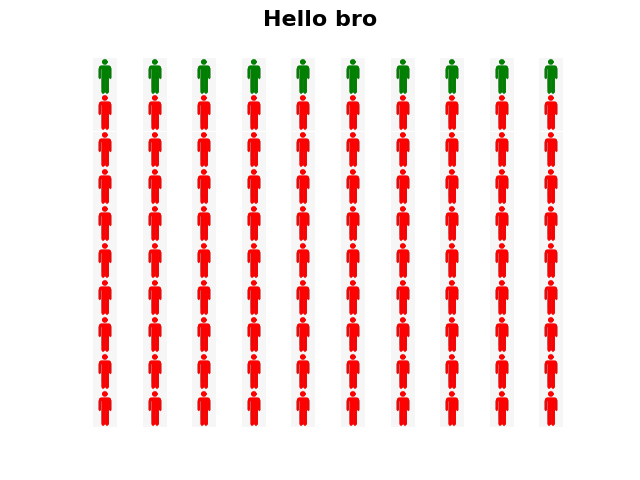

# pypersongraph
pypersongraph is based matplotlib .. matplotlib version ==3.3.3
# pypersongraph version = 0.1
  - python person graph based on matplotlib library
  - requirements.txt


simple example :
## Default Values
```
from pypersongraph import PyPersonGraph
showing = PersonGraph(dimensions=(10,10), 
                    first_rate = 10,
                    first_color="red",
                    second_color="green",
                    title ="HOLA HOLA")
showing.show()
```


- simple example image background.py
- default image person_white.pg
- other images with pixel in for loop manuel changes.

support images : 
Referans https://www.rapidtables.com/web/color/
- gold:255,215,0
- green:0,128,0
- pink :255,192,203
- purple : 128,0,128
- red: 255,0,0
- yellow:255,255,0
- black : 0 0 0
- blue : 0,0,255
